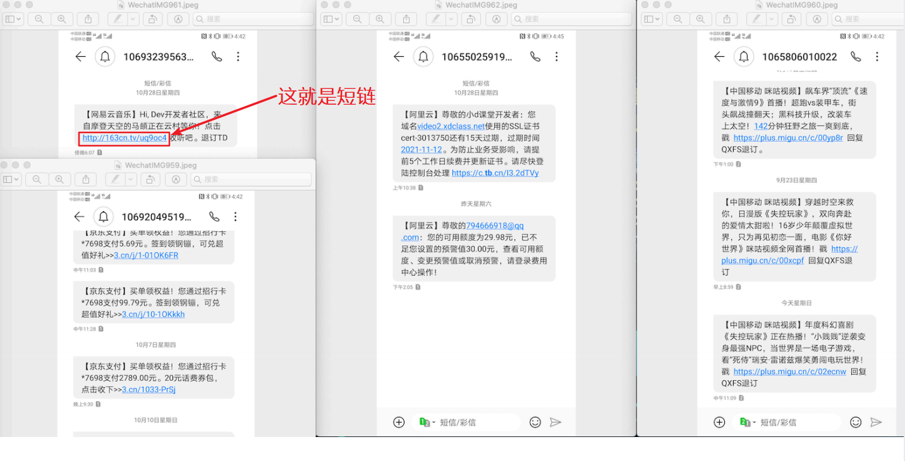
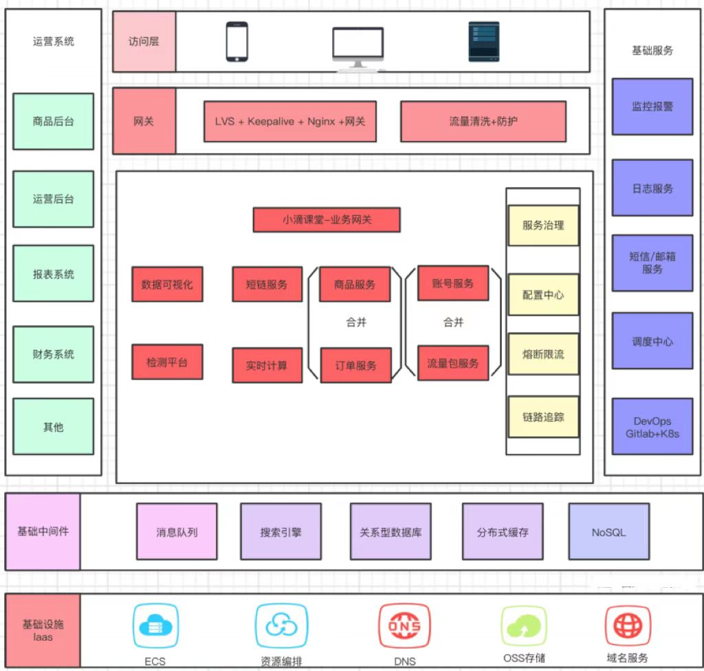

# dcloud-short-link

###  **一.项目介绍**

- 公司电商产品推广、业务活动页、⼴告落地页缺少实时【数据反馈和渠道效果分析】
- ⽼项⽬业务推广【没⼈维护，⽆法做埋点】需要统计效果
- 例⼦ https://tongji.baidu.com/web/demo/overview/index?siteId=16847648
- APP和营销活动发送营销短信链接过⻓，【浪费短信发送费⽤】
- 国内反垄断后，微信、抖⾳、淘宝 流量互通，很多知识付费公司需要做 私域流量、社群运营
- 可以对外做产品输出，实现商业化能⼒增加公司营收
- 积累终端数据和⼈群数据，为公司未来产品⼈群做策略助

###  二.项目结构

dcloud-short-link项目  
├── dcloud-common  -- 公共依赖包  
├── dcloud-app  -- Flink+Kafka实时计算  
├── dcloud-account  -- 账号+流量包微服务  
├── dcloud-data  -- 数据可视化微服务  
├── dcloud-gateway  -- 业务网关  
├── dcloud-link -- 短链微服务  
└── dcloud-shop -- 流量包商品+支付微服务 

  
### 三.微服务技术栈

├── JDK8  
├── SpringBoot 2.5.5  
├── SpringCloud 2020.0.4  
├── AlibabaCloud 2021.1  
├── Sharding-JDBC 4.1.1  
├── Mysql 8.0  
├── Nacos 2.0.2  
├── Redis 6.2.4  
├── RabbitMQ 3.8.15  
├── Kafka : wurstmeister/kafka:2.13-2.7.0  
├── XXL-Job : 分布式定时调度  
├── ClickHouse :数据库  
├── Docker容器部署  
├── DevOps + CICD  
└── Rancher容器管理平台  

### 四.项目架构

### 五.短链平台的盈利点

- ⽤户按量付费，根据流量包选择付费购买对应的套餐
- 不同流量包权益不⼀样
- 每天可以创建的短链次数不⼀样
- 流量包使⽤时间限制、⽀持流量包叠加
- 注册⽤户每天有⼀定免费使⽤次数，但是不能查看数据

### 六.短链平台产品目标

- 满⾜公司现有业务的营销推⼴需求、数据分析和拉新促活能⼒
- 对外进行付费商用，⽀持企业私有化部署
- ⾸年⽇活用户： 10万
- ⾸年⽇新增短链数据：10万*50 = 500万
- 年新增用户数：50万/1年
- 年营收目标: 10万付费⽤户 * 客单价200元 = 2千万
- 新增短链：50条/⽤户每⽇
- 年私有化部署用户数：1K⽤户 * 3万/单价 = 3千万
